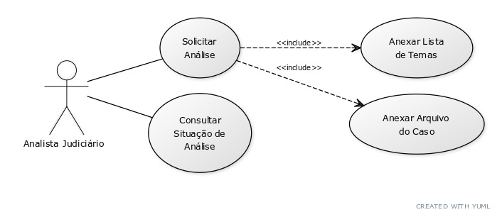
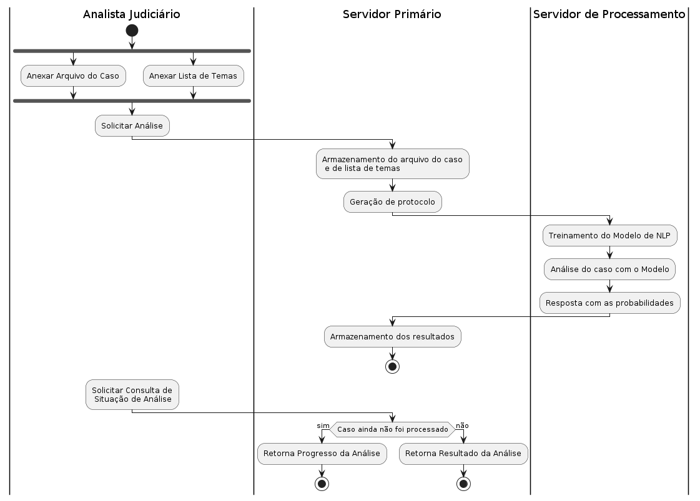

# BuscaTema
Ferramenta para busca de temas associados a um recurso especial

## Contextualização
Extremamente relevantes para garantir o justo curso do processo legal e o direito à ampla defesa, os recursos são utilizados para contestar decisões judiciais. No contexto jurídico brasileiro, recursos especiais são uma categoria à parte desses mecânismos expressa na Constituição Federal vigente e regulamentada pelo Código de Processo Civil de 2015. São de competência do Superior Tribunal de Justiça (STJ), cuja função é tornar uniforme a interpretação da lei federal.

Emitir um recurso especial requer que a decisão contestada tenha passado, anteriormente, por todas as instâncias ordinárias, isto é, seja emitida por um tribunal de segunda instância. O tribunal de origem deve verificar – antes de encaminhar ao STJ – se o recurso é válido e atende aos requisitos; para isso, deve consultar os "temas", que representam decisões já estabelecidas pelo STJ.

Os temas são importantes consolidações da jurisprudência; as interpretações estabelecidas que representam facilitam o entendimento das leis e servem de referência para futuras decisões de todos os tribunais do país.

## Como funciona?
O analista judiciário anexa uma lista de temas e um arquivo do caso; o BuscaTema, então, retorna alguns desses temas juntamente com a probabilidade de cada um descrever a situação do caso. Para o profissional, a ferramenta representa agilidade através da automação; uma grande quantidade de tempo que seria despendida nessa tarefa pode ser direcionada a tarefas mais importantes. O recurso não anula a necessidade de avaliação humana, mas agiliza e direciona o profissional.

Em versões futuras, a ferramenta permitirá o acompanhamento do processo de análise por parte do analista.

## Como o sistema está organizado?
Dois servidores são utilizados: o primeiro gerencia os pedidos para análise e o segundo é de fato o responsável pelo processamento computacional.

## Para inicializar a interface

1. Instalar o [nodejs](https://nodejs.org/en) caso não possua

2. Acessar a pasta ui
   `cd ui`

3. Instalar os módulos necessários `npm i`

4. Inicializar a interface `npm start`

## Para inicializar o backend

1. Instalar o [python](https://www.python.org/) caso não possua

2. Acessar a pasta backend
   `cd backend`

3. Instalar os módulos necessários `pip install -r requirements.txt`

4. Inicializar o backend `py app.py`
