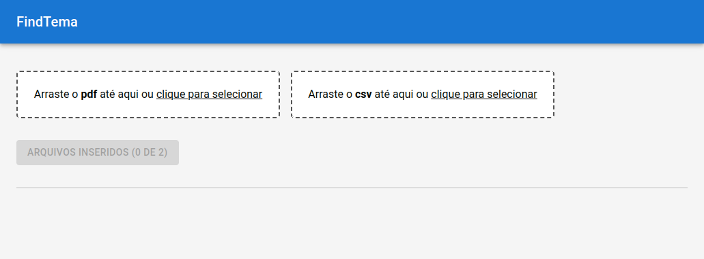
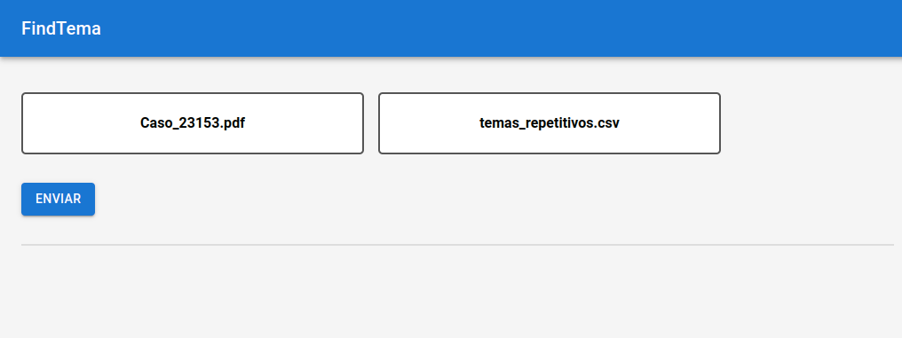
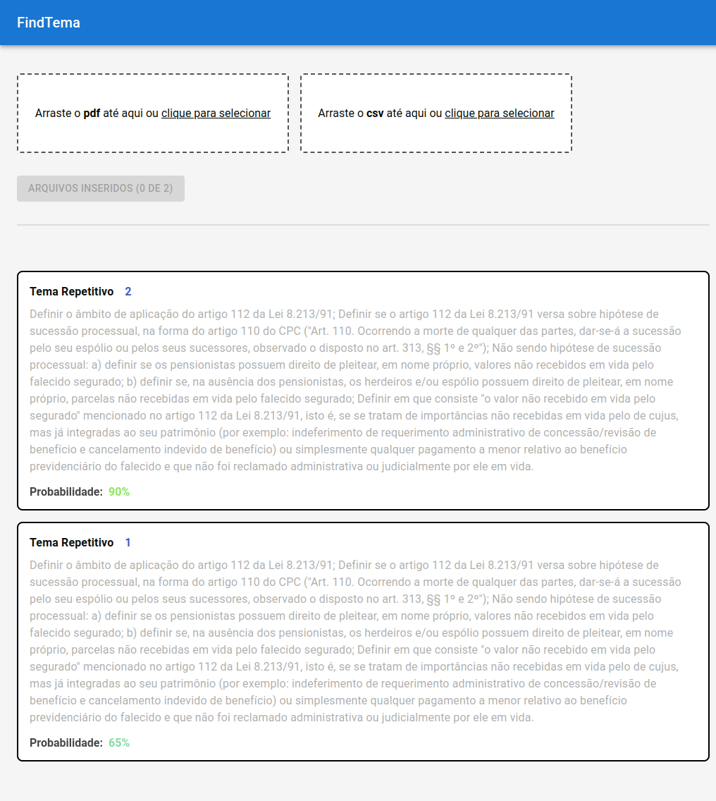

# BuscaTema
Ferramenta para busca de temas associados a um recurso especial

# Conteúdos
[Contextualização](#contextualização) 
[Como funciona?](#como-funciona) 
[Como o sistema está organizado?](#como-o-sistema-está-organizado) 
[Tecnologias Envolvidas](#tecnologias-envolvidas) 
[Manual do Usuário](#manual-do-usuário) 
[Manual do Desenvolvedor (1/2) - Instalação e Execução da Interface](#instalação-e-execução-da-interface) 
[Manual do Desenvolvedor (2/2) - Instalação e Execução do Back-end](#instalação-e-execução-do-back-end) 

## Contextualização
Extremamente relevantes para garantir o justo curso do processo legal e o direito à ampla defesa, os recursos são utilizados para contestar decisões judiciais. No contexto jurídico brasileiro, recursos especiais são uma categoria à parte desses mecanismos expressa na Constituição Federal vigente e regulamentada pelo Código de Processo Civil de 2015. São de competência do Superior Tribunal de Justiça (STJ), cuja função é tornar uniforme a interpretação da lei federal.

Emitir um recurso especial requer que a decisão contestada tenha passado, anteriormente, por todas as instâncias ordinárias, isto é, seja emitida por um tribunal de segunda instância. O tribunal de origem deve verificar – antes de encaminhar ao STJ – se o recurso é válido e atende aos requisitos; para isso, deve consultar os "temas", que representam decisões já estabelecidas pelo STJ.

Os temas são importantes consolidações da jurisprudência; as interpretações estabelecidas que representam facilitam o entendimento das leis e servem de referência para futuras decisões de todos os tribunais do país.

## Como funciona?
O analista judiciário anexa uma lista de temas e um arquivo do caso; o BuscaTema, então, retorna alguns desses temas juntamente com a probabilidade de cada um descrever a situação do caso. Para o profissional, a ferramenta representa agilidade através da automação; uma grande quantidade de tempo que seria despendida nessa tarefa pode ser direcionada a tarefas mais importantes. O recurso não anula a necessidade de avaliação humana, mas agiliza e direciona o profissional.

Em versões futuras, a ferramenta permitirá o acompanhamento do processo de análise por parte do analista.

## Como o sistema está organizado?
Dois servidores são utilizados: o primeiro gerencia os pedidos para análise e o segundo é de fato o responsável pelo processamento computacional.

## Tecnologias Envolvidas
A aplicação consiste em duas partes: uma Single-Page Application \(SPA\) escrita em [React](https://react.dev/), um framework [javascript](https://developer.mozilla.org/pt-BR/docs/Web/JavaScript), e um servidor intermediário, em [Flask](https://flask.palletsprojects.com/en/3.0.x/), uma biblioteca [python](https://www.python.org/). O processamento referente a casos judiciais acontece em um terceiro módulo, que ainda não faz parte desse repositório.

No momento, o servidor intermediário armazena os arquivos enviados pelo usuário e envia uma resposta _hard-coded_. A aplicação que de fato processa os documentos está sendo refinada e a integração está prevista para acontecer em breve. A ideia, no entanto, é manter as interfaces para que não sejam necessárias modificações adicionais.

Devem ser utilizadas as versões mais recentes do Node.JS e Python que tenham suporte ativo.

## Manual do Usuário
Com a interface gráfica e o servidor do BuscaTema já em funcionamento, você deve enviar o arquivo do caso e a lista de temas que será utilizada pela aplicação.

A tela inicial estará assim: 

Após arrastar os arquivos correspondentes até os campos, ou selecioná-los entre os arquivos de seu computador, a tela ficará assim: 

Clique em ENVIAR e receberá, rapidamente, a lista com alguns temas juntamente com a probabilidade de estarem relacionados ao texto do caso: 

## Instalação e Execução da Interface
O desenvolvedor deverá seguir as etapas abaixo para executar o front-end em sua máquina. Os passos foram descritos considerando um sistema baseado em Unix 03:

1. Clonar e acessar este repositório: 
   `git clone https://github.com/MLRG-CEFET-RJ/buscatema` 
   `cd buscatema`

2. Instalar o [Node.js](https://nodejs.org/en) caso não o possua. **Recomenda-se a última versão LTS**

2. Acessar a pasta ui: 
   `cd ui`

3. Instalar os módulos necessários: 
   `npm i`

4. Inicializar a interface: 
   `npm start`

É importante que o back-end esteja em execução na porta 5000 para que a resposta da requisição seja corretamente recebida. 

## Instalação e Execução do Back-end
O desenvolvedor deverá seguir as etapas abaixo para executar o back-end em sua máquina. Os passos foram descritos considerando um sistema baseado em Unix 03:

1. Instalar o [python](https://www.python.org/) caso não possua

2. Acessar a pasta backend: 
   `cd backend`

3. Instalar os módulos necessários: 
   `pip install -r requirements.txt`

4. Inicializar o back-end: 
   `py app.py`

\(Opcional\) Utilize o módulo [venv](https://docs.python.org/3/library/venv.html) para manter o conjunto de dependências desse projeto isoladas de seu ambiente Python local:

5. Criar, antes de instalar os módulos necessários, um ambiente isolado:
   `python -m venv busca-env`

6. Ativar o ambiente:
   `source busca-env/bin/activate`

7. Seguir normalmente do passo 2 ao passo 4
